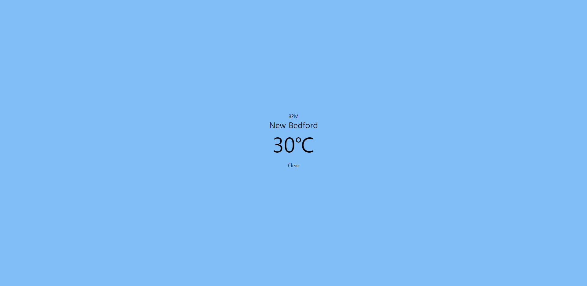

# 마가렛의 첫  인큐베이팅 과제

 **여러분이 해야할 일**
 - 능력없는 마가렛 놀리지말기
 - 날씨 API를 사용하여 (OpenWeatherMap) 세계 날씨 정보 들고오기
 - 비와 눈이 내리는 효과(애니메이션)를 Javascripts Canvas로 구현하기
 - 편하게 질문하기! 부담스러우면 개인톡 하셔도 됩니다! 제가 질문내용+답변 정리해서 단톡방에 올려드릴게요..!

## 각자 맡은 도시가 있어요!

모두 같은 나라만 보여주는 건 심심해서 각자 나라들을 배정하려고 해요. 공평하게 사다리타기로 진행했으니 걱정하지마세요! 단톡방에 사다리 타기한게 바로 여러분들의 도시랍니다!

Manhattan (미국)
London (영국)
Seoul (한국)
Vladivostok (러시아)

api문서에서 각 도시로 설정하는 방법이 나와있어요. 각 해당 도시 이름으로만 바꿔주면 돼요!

### 마가렛이 추천하는 과제 코스!

☝ 1. 날씨 Api를 사용할때 반드시 필요한 정보들을 파악한다!
> 토큰..이라던가.. api가 주는 Json 중 완성본에서 보이는 정보들.. 있잖아요?  

✌  2. 먼저 날씨 Json 정보를 가져와서 뿌리는 코드를 짜보자!
🤟3. 날씨 정보를 들고오는 것에 성공했다?! 그럼 이제 Rainy.js 파일을 들여다 보면서 비가 오도록 기우제를 지내세요!

# 필수로 짚고 넘어갔으면 하는것들

1. node js + express + node 모듈 중 request
> 우리 리액트 해야되잖아요! 그럼 먼저 노드형님부터 알아야 된다구요! 그래서 일부러 express로 페이지를 구성해왔어요! 

## 명세서

 **필수 만족 사항**
 1. 현지 날씨와 시간에 맞춰 배경화면이 변경되어야함. (새로고침 했을때)
 > 일몰, 일출 시간에 맞춰 변경하고 싶었으나 시간관계상.. 오전/오후6시 이후 시간을 기준으로 배경화면 색을 바꾼다. ex) 비가 오는 오전 -> 칙칙한 하늘색(대충 칙칙하다 싶으면 그 색 쓰면되요) , 그냥 화창한 오전 -> 하늘색, 밤 -> 어두운 밤에 맞추기 
 > 
 2. Api에서 던져주는 Main 날씨 중 Clouds, Clear, Snow, Rain만 구현해도됨. 그 중 눈과 비를 제외한 날씨 효과는 background-color로만 연출해도 됨.
 > 구름끼거나 날씨가 좋으면 그에 맞는 배경화면으로 떼우시면 됩니다.. 
 4. 날씨 Api에 맞춰 시계가 반영되어야함. (날씨 api에서 주는 시간은 날씨 갱신 시간으로 현실 시간보다 늦다는점 참고) 
 5. 창 크기를 변경할 경우 캔버스의 크기도 함께 변경되어야함.

# 완성화면
> 온도 아래에 Clear은 무시해주세요... 임의로 날씨를 바꾼거라 화창한게 맞는 날씨입니다ㅠ
> 

화창한 날씨

눈오는 날씨

비오는 날씨

https://openweathermap.org/api 로 들어가서 회원가입 한 후 

동그라미친 해당 Api를 사용하면 되요!

